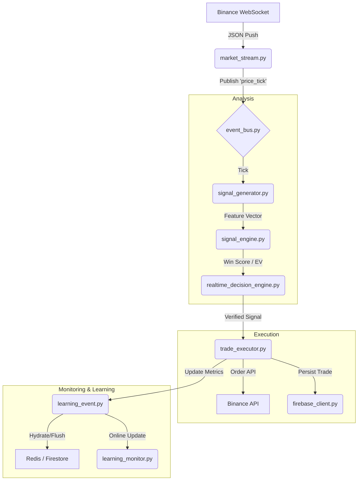

# HF-Quant 5.0: System Architecture

This document provides a high-level overview of the architectural design, data flow, and fundamental logic of the HF-Quant 5.0 trading engine.

## 1. High-Level Data Flow

The system follows a reactive, event-driven pipeline where market data triggers a chain of analysis and execution.

## 2. Core Feedback Loops

### A. The Calibration Loop
- **Purpose**: To align "Confidence" (probability of win) with "Empirical Reality".
- **Logic**: Every closed trade is passed to the **Calibrator** (in `realtime_decision_engine.py`). It uses a Bayesian update step to refine its bucketed win-probability map. If the system over-confidently predicts wins, the calibrator automatically down-scales future confidence scores.

### B. The Performance Loop
- **Purpose**: Dynamic risk management.
- **Logic**: `learning_monitor.py` tracks the **Health** of the system based on `Convergence` and `Edge Strength`. 
  - **Convergence**: Stability of the Expected Value (EV) over the last 10–20 trades.
  - **Health < 0.10**: Triggers "Crisis Mode" → tightened entry thresholds and reduced position sizing.

## 3. Persistence & State Management

The system uses a **Hybrid Persistence Model** to balance low-latency execution with long-term data integrity.

- **Firestore (Source of Truth)**:
  - Stores all `trades/` and `signals/`.
  - Maintains `system/stats` (atomic counters for total wins/losses).
  - Used for long-term recovery and mobile app synchronization.

- **Redis (Real-time Cache)**:
  - Stores the `LM_STATE` (Learning Monitor metrics).
  - Used for zero-loss cold starts (hydration on boot).
  - If Redis is unavailable, the system falls back to a **Bootstrap-from-History** mode, re-downloading the last 100 trades from Firestore to rebuild state.

## 4. Execution Guardrails

1. **Macro Guard**: Filters signals based on symbol correlation and overall market regime.
2. **Circuit Breaker**: Halts trading if `MAX_LOSS_STREAK` (default 3) is breached.
3. **Defense Efficiency**: Tracks `wall_exits` and `l2_rejections` to ensure the L2 (Order Book) filters are adding value.
