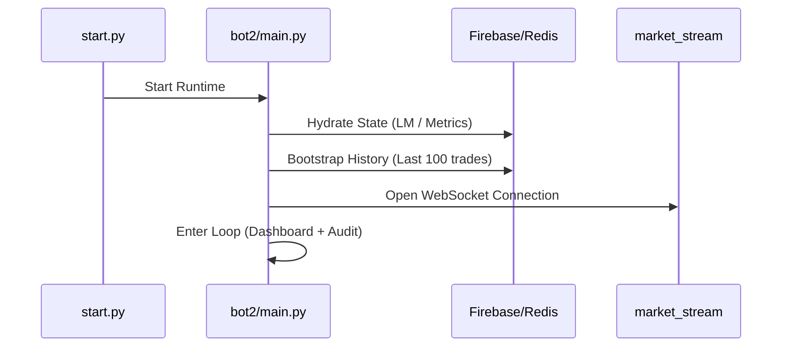

# Orchestration & Runtime: bot2

The `bot2` directory contains the application's entry point and the high-level orchestration logic that manages the system's lifecycle and health.

## 1. The Main Loop: [main.py](file:///c:/Projects/CryptoMaster_srv/bot2/main.py)
This is the central heartbeat of the application. It orchestrates the following sequence:

1.  **Hydration**: Restores `Learning Monitor` and `Metrics` state from Redis or Firestore.
2.  **Model Warmup**: Pre-generates intelligence vectors for active symbols.
3.  **Bootstrap**: Re-downloads recent trade history to align the local state with the exchange.
4.  **The Loop**: A non-blocking asynchronous cycle (using `SignalEngine` and `threading`) that prints the live dashboard and triggers periodic maintenance:
    *   **Audit** (30s): Runs the strategy reviewer.
    *   **Metrics** (30s): Persists latest health snapshots to Firestore.
    *   **Pre-Audit** (2h): Runs a historical replay simulation to detect drift.

## 2. The Strategy Auditor: [auditor.py](file:///c:/Projects/CryptoMaster_srv/bot2/auditor.py)
The Auditor is a soft-stop safety mechanism. It doesn't instantly kill the bot; instead, it dynamically degrades performance to protect capital.

- **Bias Detection**: Detects psychological trading biases like `recency_overconfidence` or `revenge_trading_risk` (based on loss streaks and frequency spikes).
- **Position Scaling**:
  - Loss Streak ≥ 3 → 60% position size.
  - Loss Streak ≥ 5 → 30% position size.
- **Drawdown Halt**: If a 40% relative drawdown is detected, the auditor triggers a 30-minute cooling-off period.

## 3. Self-Healer & Stabilizer
- **[stabilizer.py](file:///c:/Projects/CryptoMaster_srv/bot2/stabilizer.py)**: Detects stalled WebSocket connections or database hang-ups and triggers a graceful restart of the specific component.
- **[self_evolving.py](file:///c:/Projects/CryptoMaster_srv/bot2/self_evolving.py)**: Logic for adjusting internal hyperparameters (like decay rates) based on multi-day performance trends.

---

## Startup Sequence Diagram

